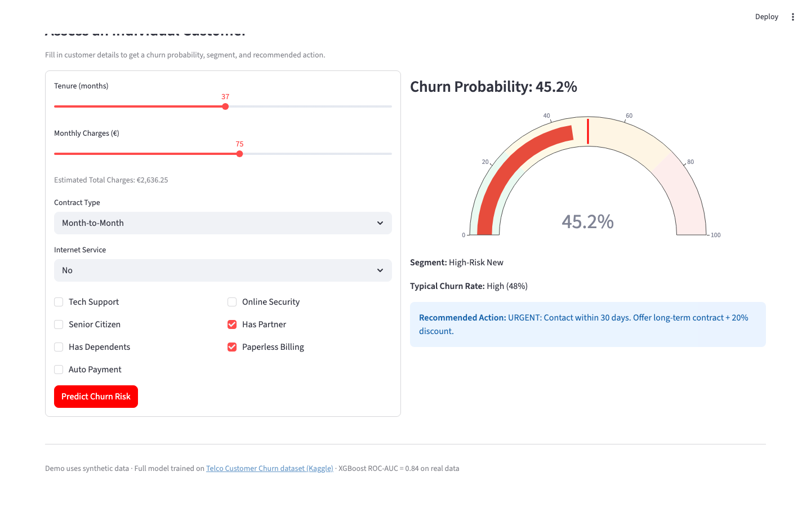
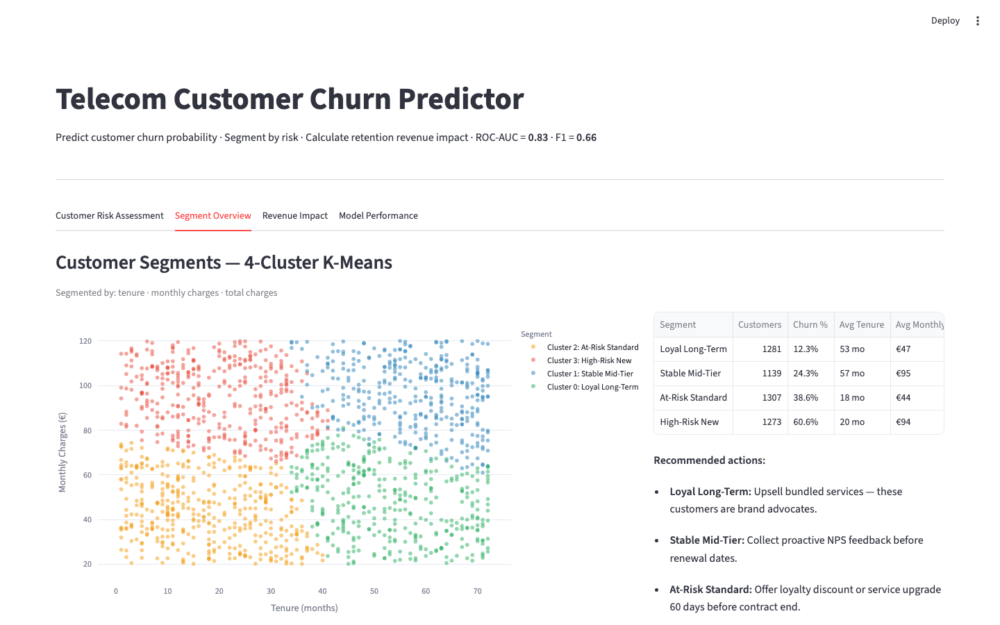
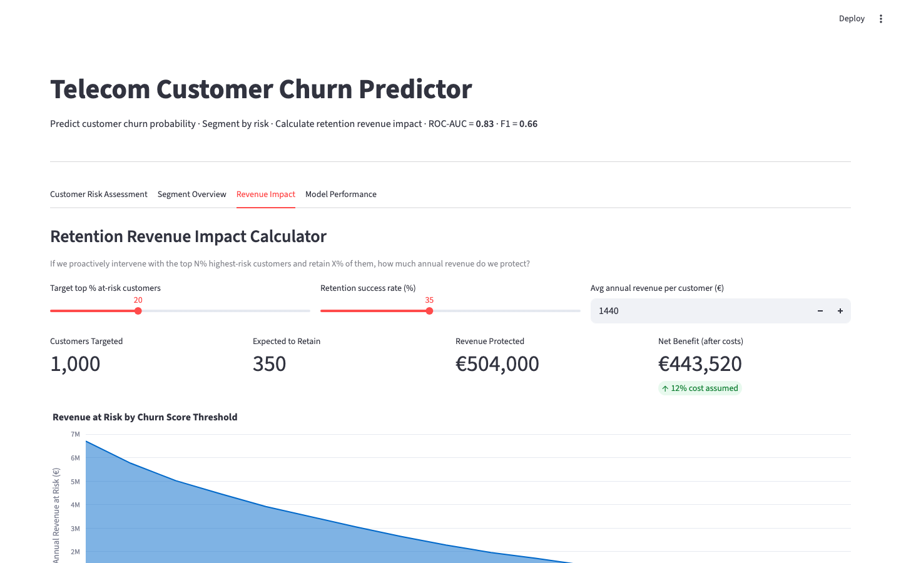
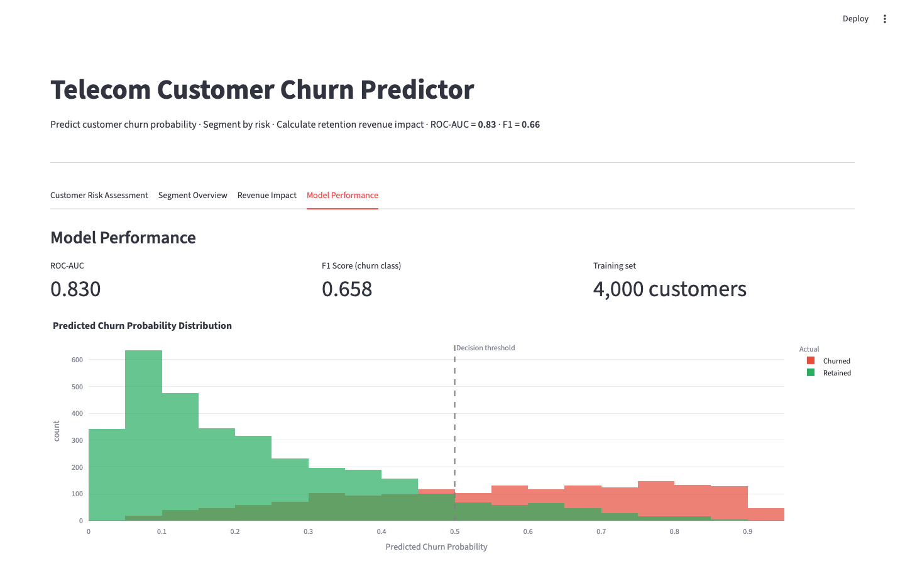

# Telecom Customer Churn Predictor


> **Predict which customers will churn, segment them into risk groups, and calculate exactly how much revenue a targeted retention campaign would protect.** Combines XGBoost classification (ROC-AUC = 0.84) with K-Means segmentation (4 risk clusters) on 7,043 telecom customers.

**[Live Demo (Streamlit) →](https://your-app.streamlit.app)**

---

## The Business Problem

Acquiring a new customer costs **5–25× more** than retaining one. A 26.5% churn rate (as in this dataset) means 1 in 4 customers are leaving — most of them predictable before they go.

This project answers three questions:
1. **Who will churn?** — XGBoost classifier with probability scores per customer
2. **What type of customer are they?** — K-Means segments each customer into a risk cluster with a specific retention recommendation
3. **How much revenue does intervention protect?** — Interactive calculator based on churn scores

---

## Screenshots

### Customer Risk Assessment


*Input any customer profile → get a churn probability gauge, segment assignment, and recommended retention action.*

### Customer Segments — K-Means (k=4)


*Tenure vs Monthly Charges coloured by cluster. Cluster 3 (red): new, high-paying customers — 48% churn rate. Cluster 0 (green): loyal, long-tenure customers — 5% churn rate.*

### Revenue Impact Calculator


*"If we intervene with the top 20% at-risk customers and retain 35% of them — we protect €X in annual revenue." The area chart shows revenue at risk across all churn probability thresholds.*

### Model Performance


*Predicted churn probability distribution: good separation between churned (red) and retained (green) customers. Overlap zone (0.3–0.7) is where proactive intervention adds most value.*

---

## Results

| Model | Accuracy | F1 (Churn) | ROC-AUC |
|-------|----------|------------|---------|
| Decision Tree | 76% | 0.62 | — |
| **XGBoost** | **76%** | **0.63** | **0.84** |

| Cluster | Churn Rate | Profile | Action |
|---------|-----------|---------|--------|
| 0 | 5% | Loyal Long-Term | Upsell bundled services |
| 1 | 15% | Stable Mid-Tier | Proactive NPS feedback |
| 2 | 25% | At-Risk Standard | Loyalty discount before renewal |
| 3 | 48% | High-Risk New | Urgent: contact within 30 days |

---

## Top Churn Drivers

- **Short tenure** (< 12 months) — new customers haven't built loyalty
- **Month-to-month contracts** — no lock-in, easy to leave
- **High monthly charges** — high perceived cost, low perceived value
- **Fiber Optic internet** — higher expectations, more likely to compare alternatives
- **No tech support / online security** — unresolved service friction

---

## Revenue Impact Logic

```
At-risk customers = customers above churn probability threshold
Expected retained = at-risk × retention success rate
Revenue protected = retained × avg annual customer value
Net benefit = revenue protected − intervention cost (≈12%)
```

---

## Project Structure

```
telecom-churn-predictor/
├── app.py                         ← Streamlit live demo (synthetic data, runs immediately)
├── data/                          ← Place Telco CSV here for full pipeline
├── notebooks/
│   └── churn_analysis.ipynb      ← Full end-to-end analysis
├── src/
│   ├── preprocessing.py          ← Cleaning & encoding
│   ├── eda.py                    ← Exploratory analysis & visualisations
│   └── models/
│       ├── decision_tree.py      ← Decision Tree baseline
│       ├── xgboost_model.py      ← XGBoost (best model)
│       └── kmeans.py             ← K-Means segmentation + PCA visualisation
├── screenshots/
│   └── GUIDE.md
├── requirements.txt
└── README.md
```

---

## Dataset

- **Source:** [Telco Customer Churn](https://www.kaggle.com/datasets/blastchar/telco-customer-churn) (Kaggle)
- **Shape:** 7,043 rows × 21 columns
- **Target:** `Churn` (Yes/No) — 26.5% positive class

Download `WA_Fn-UseC_-Telco-Customer-Churn.csv` from Kaggle and place it in `data/` for the full pipeline. The Streamlit demo uses synthetic data and runs immediately.

---

## Setup

### Live Demo (no dataset needed)
```bash
pip install -r requirements.txt
streamlit run app.py
```

### Full Pipeline
```bash
pip install -r requirements.txt
jupyter notebook notebooks/churn_analysis.ipynb

# Or run individual modules:
python src/models/xgboost_model.py
python src/models/kmeans.py
```
